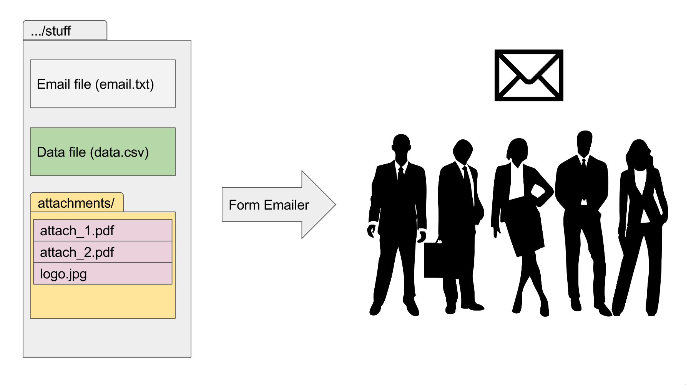

# form-emailer 
Sends emails from a template and a data file.

## Introduction
I was tasked to send many similar emails. Each email had to be personalised
with the recipients' names and the attachments differed as well (each
recipient received their own Word document—see
[form-letterer](https://github.com/lieuzhenghong/form-letterer).)

This program automatically sends emails. Here's how it works:




## Installation
### Windows
I have compiled an executable: just grab `prompt.exe` in `dist` folder and run it.

If you get an error "VCRUNTIME140.dll is missing", you'll have to download Microsoft's Visual C++ Redistributable for Visual Studio 2015 [here](https://www.microsoft.com/en-us/download/details.aspx?id=48145).

### All other operating systems
```
git clone https://github.com/lieuzhenghong/form-emailer.git
cd form-emailer
python3 prompt.py
```
Must have Python 3 installed.

## Data files
### data.csv
You can add as many columns and rows as you want to your `data.csv` file. The
only required column is the `to` column. All other columns don't have to be in
your `data.csv`.

Here's an example of a `data.csv` file:

| name  | amount | to | cc | bcc | attachments |
| ----- | ------------- | --- | --- | --- | --- |
| Jack | 500 | lzh@gmail.com, jack@email.com | pqrs@email2.com | | test.png, test1.pdf |
| CKY | 300 | cky@gmail.com | | pqrq@email3.com | test.png |

#### to
**(REQUIRED)** Who the email will be sent to.
Separate multiple emails with commas: `guy1@email.com, guy2@email.com`
etc.

#### cc
Self-explanatory. See `to`.

#### bcc
Self-explanatory. See `to`.

#### attachments
**All attachments must be in the attachments/ folder.**

Most file types **should** be accepted.

Separate multiple attachments with commas: `attach1.png, attach2.pdf`.

### email.txt
**The first line of `email.txt` must be SUBJECT: XYZ**

Anything in `email.txt` surrounded by `` `backticks` `` will be replaced by the
corresponding column in `data.csv`.

For example, `` `name` `` would be replaced by `Jack` for the first email and
`CKY` in the second.

Here's a sample email:
```
SUBJECT: Happy birthday to you!
Dear `name`,

Thanks for being our loyal customer and for giving us `amount` dollars.

Sincerely,
iGlobe Partners
```

This will become:

```
Email 1 of 2:

Dear Jack,

Thanks for being our loyal customer and for giving us 500 dollars.

Sincerely,
iGlobe Partners


Email 2 of 2:

Dear CKY,

Thanks for being our loyal customer and for giving us 300 dollars.

Sincerely,
iGlobe Partners
```

## How to use the software

```
SMTP server URL (defaults to outlook.office365.com): 
SMTP server port (defaults to 587): 
Email address to send emails from: 
Password: 
Location of folder: 
Start index (if any?): 
End index (if any?): 
Send without previewing? (y/n):    
```

### SMTP server URL
The SMTP url. Defaults to outlook.office365.com as this program was originally
written for iGlobe Office which uses Office365 Outlook.
If you're using other email providers, you'll have to change this. Gmail's one
for example is `smtp.google.com.`

### SMTP sever port
The SMTP port. Defaults to 587; same reason.

### email address
**(REQUIRED)** Your email address.

### password
**(REQUIRED)** Your password.

### Location of folder
**(REQUIRED)** The main folder your `data.csv`, `email.txt` and `attachments`
live in.

### Start index and end index
None, either, or both of these parameters can be specified.

1. If neither are specified
2. If only `index-start` is specified
3. If only `index-end` is specified
4. If both are specified

#### If neither are specified
All emails will be selected.

#### If only `index-start` is specified
Only one email will be selected, which is the `index-start`. For example,
`--index-start 3` will select the third email.

#### If only `index-end` is specified
The first email to the `index-end`th email will be selected (inclusive).
For example, `--index-end 3` will select three emails, 1st, 2nd and 3rd.

#### If both are specified
Emails from `index-start` to `index-end` (inclusive) will be selected.
For example, `--index-start 2 --index-end 3` will select two emails: 2nd and 3rd.

### Send without previewing
By default, this is not selected and the emails will be previewed before
sending them. Type 'y' to send the emails directly. 

## Limitations
Outlook limits the number of emails you can send at 30/minute. Hence if you try
to send too many, you'll get an error and not all emails will send. Work around
this by using `--index-start` and `--index-end` to send emails in batches.
