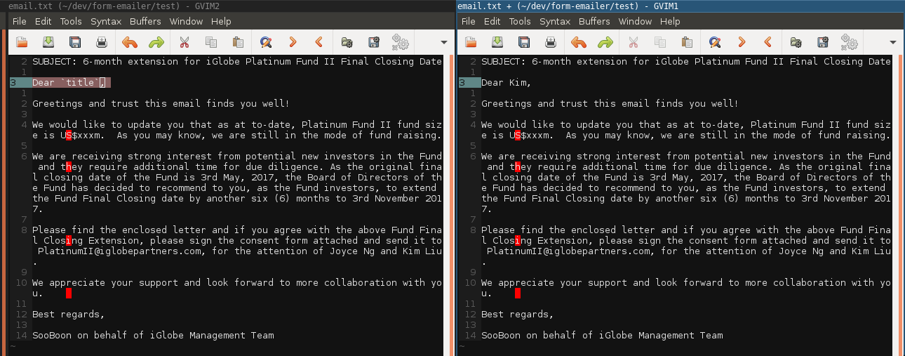

# form-emailer 

## Setup
Files needed:

* `data.csv` with header row
* `email.txt`

### data.csv

For `data.csv`, each row corresponds to one document to be created.

The following columns are required:
* email (who to send the email to)
* email_cc
* attachment_name (supports multiple attachments, separated by commas)

Here's what your data.csv could look like: 

Feel free to add additional fields but this is the minimum.

### email.txt

Your `email.txt` should look something like this: 

Anything surrounded by backticks (the "~" key on your keyboard) will be
**replaced** by the corresponding column in `data.csv`! For example,

The first line of `email.txt` **must** be `SUBJECT: your subject here`. 
Don't split the subject up into two lines, it has to be one line long. 

